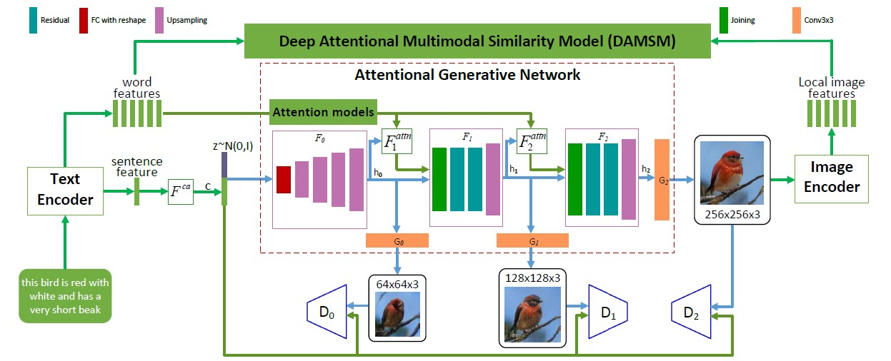

# AttnGAN

Project B - AttnGAN.  
In this project, we will try and implement the AttnGAN network proposed [here](https://arxiv.org/abs/1711.10485) using Python 3.5 and PyTorch v1.1.  
The model architecture can be described in the figure below taken from the paper:

## Running the code

* Running the code is performed from the `./src` directory.
* Code entry point is from `./src/main.py` with the following command line arguments:
    * --cfg_path
        Required to supply a path to the configuration.ini file to work with
    * --train
        Use this to train the model
* Generating new images can be done using the `./notebooks/generate.ipynb` notebook with trained weights.
* Code should run on a single GPU

### Dependencies

All dependecies can be found in the `requirements.txt` file.  
Install all dependencies using `pip install -r ./requirements.txt`.

### Training

Training consist of 2 parts:

1. Pre-training of the DAMSM module, using the `damsm_train.ini` file.
2. Training of the AttnGAN module, using the `attngan_train.ini` file.

### Configurations

Every training run has a different configuration file.  
For example, trainining the DAMSM module might have a different configurations requirements than training the AttnGAN module.
Also, differenent experiments that require different hyperparameters will need to change the configrations file.
Thus, we created a `config_files` folders that holds all different configuration files.

* To add a new configuration option:
    1. Add to the relevant config file
    2. add the relevant config option to `config.py` file in `./src/uitilities` 
    3. Add the relevant changes in the source code.
* To change a configuration, just change it in the config file in `./config_files`

Important: Change the paths to the relevant paths to existing models when training.  

## References

Xu, T., Zhang, P., Huang, Q., Zhang, H., Gan, Z., Huang, X., & He, X. (2018). Attngan: Fine-grained text to image generation with attentional generative adversarial networks. In Proceedings of the IEEE Conference on Computer Vision and Pattern Recognition (pp. 1316-1324).

T. Salimans, I. Goodfellow, V. Cheung, A. Radford, and X. Chen, “Improved Techniques for Training GANs,” pp. 1–10.

[How to train a GAN, NIPS 2016](https://www.youtube.com/watch?v=myGAju4L7O8&t=482s)

### Questions?

Contact either:  

* [Matan Danos](https://github.com/MatanDanos)
* [Ohad Wolski](https://github.com/ohadwolski)